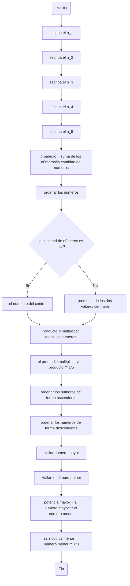

# Diagrama-de-flujo

```mermaid
graph TD;
 A(INICIO) --> B[escriba el n_1];
B --> C;
C[escriba el n_2] --> D[escriba el n_3];
D --> E;
E[escriba el n_4] --> F[escriba el n_5];
F --> G;
G[promedio = suma de los números/la cantidad de números] --> H[ordenar los números];
H --> I;
I{la cantidad de números es par?} -- Si --> J;
I -- No --> K[promedio de los dos valores centrales];
J[el numerito del centro] --> L[producto = multiplicar todos los números. ];
K --> L;
L --> M[el promedio multiplicativo = producto ** 1/5];
M --> N;
N[ordenar los números de forma ascendente] --> O[ordenar los números de forma descendente];
O --> P;
P[Hallar número mayor] --> Q[Hallar el número menor];
Q --> R;
R[potencia.mayor = al número mayor ** el número menor] --> S[raíz.cubica.menor = número menor ** 1/3];
S --> T(Fin)
```
