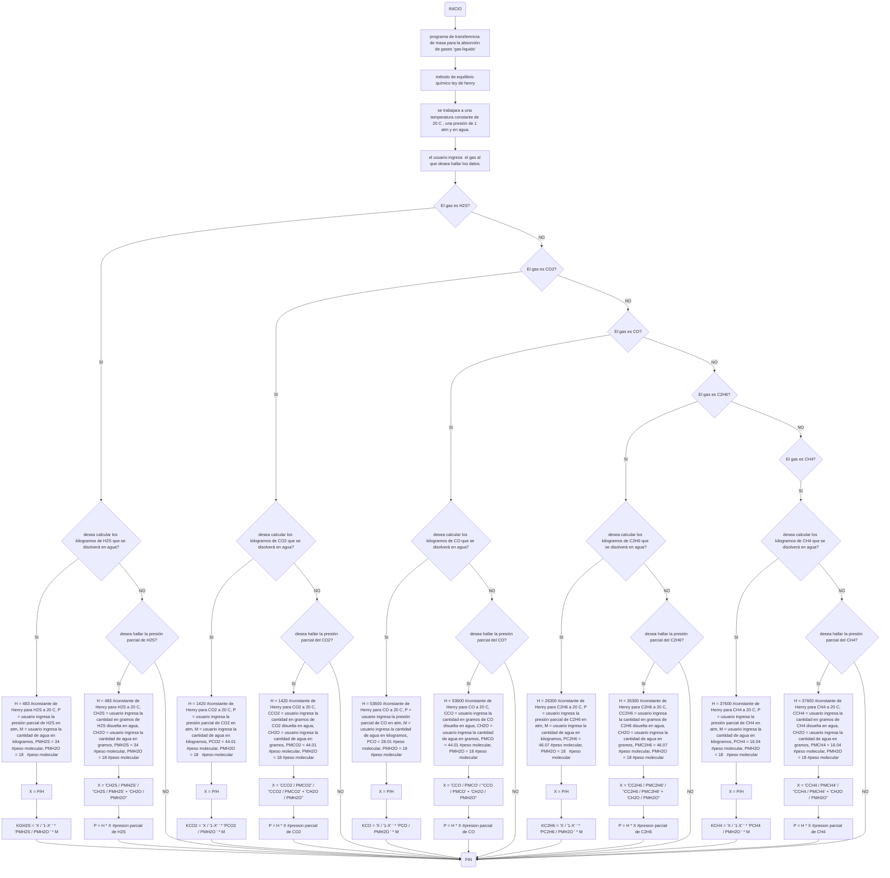

# Diagrama-de-flujo

```mermaid
graph TD;
 A(INICIO) --> B[programa de transferencia de masa para la absorción de gases 'gas-liquido'];
B --> C;
C[método de equilibrio químico ley de henry] --> D[se trabajara a una temperatura constante de 20 C , una presión de 1 atm y en agua.];
D --> E;
E[el usuario ingresa  el gas al que desea hallar los datos.] --> F{ El gas es H2S?};
F -- SI --> G{desea calcular los kilogramos de H2S que se disolverá en agua?};
G -- SI --> H[H = 483 #constante de Henry para H2S a 20 C, P = usuario ingresa la presión parcial de H2S en atm, M = usuario ingresa la cantidad de agua en kilogramos, PMH2S = 34 #peso molecular, PMH2O = 18   #peso molecular];
H --> I[X = P/H];
I --> J[KGH2S = 'X / '1-X' ' * 'PMH2S / PMH2O ' * M];
J --> Z(FIN);
G -- NO --> K{desea hallar la presión parcial de H2S?};
K -- SI --> L[H = 483 #constante de Henry para H2S a 20 C, CH2S = usuario ingresa la cantidad en gramos de H2S disuelta en agua, CH2O = usuario ingresa la cantidad de agua en gramos, PMH2S = 34 #peso molecular, PMH2O = 18 #peso molecular];
L --> M[X = 'CH2S / PMH2S' / ''CH2S / PMH2S' + 'CH2O / PMH2O''];
M --> N[P = H * X #presion parcial de H2S];
N --> Z;
K -- NO --> Z;
F -- NO --> O{ El gas es CO2?};
O -- SI --> P{desea calcular los kilogramos de CO2 que se disolverá en agua?};
P -- SI --> Q[H = 1420 #constante de Henry para CO2 a 20 C, P = usuario ingresa la presión parcial de CO2 en atm, M = usuario ingresa la cantidad de agua en kilogramos, PCO2 = 44.01 #peso molecular, PMH2O = 18   #peso molecular];
Q --> R[X = P/H];
R --> S[KCO2 = 'X / '1-X' ' * 'PCO2 / PMH2O ' * M];
S --> Z;
P -- NO --> T{desea hallar la presión parcial del CO2?};
T -- SI --> U[H = 1420 #constante de Henry para CO2 a 20 C, CCO2 = usuario ingresa la cantidad en gramos de CO2 disuelta en agua, CH2O = usuario ingresa la cantidad de agua en gramos, PMCO2 = 44.01 #peso molecular, PMH2O = 18 #peso molecular];
U --> V[X = 'CCO2 / PMCO2' / ''CCO2 / PMCO2' + 'CH2O / PMH2O''];
V --> W[P = H * X #presion parcial de CO2];
W --> Z;
T -- NO --> Z;
O -- NO --> X{ El gas es CO?};
X -- SI --> a{desea calcular los kilogramos de CO que se disolverá en agua?};
a -- SI --> b[H = 53600 #constante de Henry para CO a 20 C, P = usuario ingresa la presión parcial de CO en atm, M = usuario ingresa la cantidad de agua en kilogramos, PCO = 28.01 #peso molecular, PMH2O = 18   #peso molecular];
b --> c[X = P/H];
c --> d[KCO = 'X / '1-X' ' * 'PCO / PMH2O ' * M];
d --> Z;
a -- NO --> e{desea hallar la presión parcial del CO?};
e -- SI --> f[H = 53600 #constante de Henry para CO a 20 C, CCO = usuario ingresa la cantidad en gramos de CO disuelta en agua, CH2O = usuario ingresa la cantidad de agua en gramos, PMCO = 44.01 #peso molecular, PMH2O = 18 #peso molecular];
f --> g[X = 'CCO / PMCO' / ''CCO / PMCO' + 'CH2O / PMH2O''];
g --> h[P = H * X #presion parcial de CO];
h --> Z;
e -- NO --> Z;
X -- NO -->i{ El gas es C2H6?};
i -- SI --> j{desea calcular los kilogramos de C2H6 que se disolverá en agua?};
j -- SI --> k[H = 26300 #constante de Henry para C2H6 a 20 C, P = usuario ingresa la presión parcial de C2H6 en atm, M = usuario ingresa la cantidad de agua en kilogramos, PC2H6 = 46.07 #peso molecular, PMH2O = 18   #peso molecular];
k --> l[X = P/H];
l --> m[KC2H6 = 'X / '1-X' ' * 'PC2H6 / PMH2O ' * M];
m --> Z;
j -- NO --> n{desea hallar la presión parcial del C2H6?};
n -- SI --> o[H = 26300 #constante de Henry para C2H6 a 20 C, CC2H6 = usuario ingresa la cantidad en gramos de C2H6 disuelta en agua, CH2O = usuario ingresa la cantidad de agua en gramos, PMC2H6 = 46.07 #peso molecular, PMH2O = 18 #peso molecular];
o --> p[X = 'CC2H6 / PMC2H6' / ''CC2H6 / PMC2H6' + 'CH2O / PMH2O''];
p --> q[P = H * X #presion parcial de C2H6];
q --> Z;
n -- NO --> Z;
i -- NO --> r{ El gas es CH4?};
r -- SI --> s{desea calcular los kilogramos de CH4 que se disolverá en agua?};
s -- SI --> t[H = 37600 #constante de Henry para CH4 a 20 C, P = usuario ingresa la presión parcial de CH4 en atm, M = usuario ingresa la cantidad de agua en kilogramos, PCH4 = 16.04 #peso molecular, PMH2O = 18   #peso molecular];
t --> u[X = P/H];
u --> v[KCH4 = 'X / '1-X' ' * 'PCH4 / PMH2O ' * M];
v --> Z;
s -- NO --> w{desea hallar la presión parcial del CH4?};
w -- SI --> x[H = 37600 #constante de Henry para CH4 a 20 C, CCH4 = usuario ingresa la cantidad en gramos de CH4 disuelta en agua, CH2O = usuario ingresa la cantidad de agua en gramos, PMCH4 = 16.04 #peso molecular, PMH2O = 18 #peso molecular];
x --> y[X = 'CCH4 / PMCH4' / ''CCH4 / PMCH4' + 'CH2O / PMH2O''];
y --> aa[P = H * X #presion parcial de CH4];
aa --> Z;
w -- NO --> Z;
```
